# Vegito 完整架构图

```mermaid
flowchart TB
    %% ─── 样式 ───
    classDef ui fill:#e3f2fd,stroke:#1565c0,stroke-width:2px,color:#0d47a1
    classDef kernel fill:#fff3e0,stroke:#e65100,stroke-width:3px,color:#bf360c
    classDef core fill:#f3e5f5,stroke:#6a1b9a,stroke-width:2px,color:#4a148c
    classDef provider fill:#e8f5e9,stroke:#2e7d32,stroke-width:2px,color:#1b5e20
    classDef extend fill:#fff9c4,stroke:#f9a825,stroke-width:2px,color:#f57f17
    classDef forge fill:#fce4ec,stroke:#c62828,stroke-width:2px,color:#b71c1c
    classDef evolve fill:#e0f7fa,stroke:#00838f,stroke-width:2px,color:#006064
    classDef data fill:#efebe9,stroke:#4e342e,stroke-width:2px,color:#3e2723
    classDef support fill:#eceff1,stroke:#546e7a,stroke-width:1px,color:#37474f

    %% ═══════════════════════════════════════════════════════════════
    %% 用户入口（同一个系统，三张脸）
    %% ═══════════════════════════════════════════════════════════════
    subgraph UI["🖥️ 用户界面层 — 同一个系统，三张脸"]
        direction LR
        REPL["💬 交互终端<br/>REPL<br/>打字聊天，实时渲染"]
        HEADLESS["📡 无头模式<br/>Headless Runner<br/>JSONL流输出，给脚本用"]
        TESTS["🧪 测试驱动<br/>Scripted Runner<br/>用脚本文件模拟模型回答"]
    end
    class REPL,HEADLESS,TESTS ui

    %% ═══════════════════════════════════════════════════════════════
    %% 内核 — 纯逻辑引擎
    %% ═══════════════════════════════════════════════════════════════
    subgraph KERNEL["⚙️ 内核 Kernel — 纯逻辑引擎，零副作用"]
        direction TB

        subgraph LOOP["🔄 对话循环 Loop（异步生成器）"]
            L1["组装请求 → 调模型 → 收流式事件"]
            L2["模型说要调工具 → 执行工具 → 把结果喂回模型"]
            L3["循环直到：模型停 / 预算耗尽 / 用户打断 / 致命错误"]
        end

        REDUCER["🧮 状态机 Reducer（纯函数）<br/>(状态, 事件) → 新状态<br/>不碰文件、不调网络、纯数据变换"]

        RECOVERY["🩹 故障恢复注册表<br/>Retry-After → 压缩上下文重试 → 熔断器<br/>连续两次恢复失败或重复拒绝 = 自动熔断"]

        EXIT["🚪 退出原因枚举<br/>正常结束 | 等用户输入 | 轮次上限 | Token预算耗尽<br/>权限拒绝熔断 | 被打断 | 致命错误"]
    end
    class L1,L2,L3,REDUCER,RECOVERY,EXIT kernel

    LOOP --> REDUCER
    LOOP --> RECOVERY
    LOOP --> EXIT

    %% ═══════════════════════════════════════════════════════════════
    %% 六大核心子系统
    %% ═══════════════════════════════════════════════════════════════
    subgraph CORE["🧩 核心子系统 — 各司其职"]
        direction TB

        subgraph CONTEXT["📝 上下文管理 Context"]
            C1["三层提示词拼接<br/>第一层：身份+宪法（很少变，吃缓存）<br/>第二层：环境+Pack（偶尔变）<br/>第三层：当前对话历史（实时变）"]
            C2["上下文压缩 Compaction<br/>历史太长时自动总结老对话<br/>保留最近的对话头和关键交换"]
            C3["缓存稳定性测试<br/>多轮对话的字节级哈希快照<br/>谁的改动破坏了缓存 → 构建直接挂"]
        end

        subgraph TOOLS["🔧 工具系统 Tools"]
            T1["工具注册表：每个工具声明自己的权限键"]
            T2["内置工具：读文件 · 写文件 · 编辑 · 列目录<br/>搜索 · 执行命令 · 发网络请求<br/>待办事项 · 记忆 · 调用技能 · 派子Agent"]
            T3["Token 预算控制<br/>限制每轮消耗，防止烧钱"]
        end

        subgraph PERM["🛡️ 权限引擎 Permissions — 唯一的一道闸门"]
            direction TB
            P0["所有文件/网络/命令操作<br/>都必须经过这道门"]
            P1["① 地板层 Floor：硬编码的黑名单<br/>删根目录、fork炸弹、偷凭证文件<br/>即使在绕过模式下也绝不放过"]
            P2["② Bash解析：逐阶段检查命令<br/>管道、重定向、子命令逐级评分<br/>解不出来的命令 → 拒接，问用户"]
            P3["③ 规则层 Rules：用户/Pack自定义<br/>允许/询问/拒绝 模式匹配<br/>最严格的规则胜出"]
            P4["④ 模式默认：default/acceptEdits/plan/bypass"]
            P5["工作区围栏：路径规范化 → 防符号链接逃逸"]
            P0 --> P1 --> P2 --> P3 --> P4
        end

        subgraph AGENTS["🤝 多智能体协作 Agents"]
            A1["子会话：每个子Agent是一个独立会话<br/>有自己的上下文和工具权限"]
            A2["任务看板 Task Board<br/>父Agent分配任务 → 子Agent认领 → 完成后汇报"]
            A3["Agent间消息传递<br/>一种编排原语，不搞第二套框架"]
        end

        subgraph SESSIONS["📼 会话管理 Sessions"]
            S1["JSONL追加日志：只追加，不修改<br/>每条记录一行，可完整回放"]
            S2["恢复 Resume：从任意会话继续"]
            S3["分叉 Fork：从任意记录点分出新会话<br/>探索备选方案，不丢原始记录"]
            S4["记忆系统：三层晋升<br/>情景记忆 → 策展记忆 → 综合记忆"]
        end

        subgraph EXTEND["🔌 扩展系统 Extend"]
            E1["唯一注册表 ExtensionRegistry<br/>没有第二套插件系统"]
            E2["可注册：Pack（领域包）· Skill（技能）<br/>Slash Command（斜杠命令）· Hook（钩子）<br/>MCP Server（外部工具服务器）"]
            E3["Hook合约：退出码 0=注入上下文<br/>2=阻止并返回错误 · 其他=警告"]
            E4["Hook崩溃/超时 → 降级为警告<br/>绝不卡死主循环"]
        end
    end
    class CONTEXT,TOOLS,PERM,AGENTS,SESSIONS,EXTEND core

    %% ═══════════════════════════════════════════════════════════════
    %% 模型供应商层
    %% ═══════════════════════════════════════════════════════════════
    subgraph PROVIDERS["🌐 模型供应商层 Providers — 彻底的中立抽象"]
        direction LR
        subgraph NEUTRAL["内部中立类型"]
            N1["NeutralRequest · NeutralMsg<br/>Block · ProviderEvent<br/>——没有一行代码提到具体厂商"]
        end
        subgraph WIRES["协议适配器 WireProtocol"]
            W1["🔵 Anthropic 线路"]
            W2["🟢 OpenAI 兼容线路"]
            W3["🟡 脚本线路 ScriptedWire<br/>播放预设响应列表<br/>离线测试/Forge/Evolve全用这个"]
        end
        subgraph RELIABILITY["生产可靠性"]
            R1["故障转移链：按顺序尝试(供应商,模型)对<br/>中途切换，对话完全不感知"]
            R2["凭证池：三态密钥轮换<br/>(可用/冷却中/已废弃)"]
        end
        NEUTRAL --> WIRES
        WIRES --> RELIABILITY
    end
    class NEUTRAL,WIRES,RELIABILITY provider

    %% ═══════════════════════════════════════════════════════════════
    %% 元Harness：Forge 锻造厂
    %% ═══════════════════════════════════════════════════════════════
    subgraph FORGE["🔨 元Harness：Forge 锻造厂 — 从需求到完整Pack"]
        direction TB
        F_INPUT["输入来源<br/>① 命令行参数 --domain --archetype<br/>② 交互式问答 interview()<br/>③ 文档文件 --from docs"]

        F_PLAN["ForgePlan<br/>选定的原型模板 + 参数"]

        F_SPEC["ForgeSpec（纯数据，无IO）<br/>prompt内联文本 · 层级抽象名<br/>验证器源码体 · 完全可单元测试"]

        F_ARCHETYPES["原型模板 Archetypes（纯函数）<br/>🎓 tutor-team | 🔍 review-team | 🎨 content-studio<br/>(参数) → ForgeSpec"]

        F_GENERATE["generate.ts<br/>ForgeSpec → FileMap<br/>路径 → 内容"]

        F_OUTPUT["输出到磁盘<br/>pack.json · persona.md<br/>agents/各角色.md · rubrics/评分标准+硬验证器<br/>onboarding.md · memory/seeds.md"]

        F_CONSTRAINT["约束预算机制<br/>一个prompt里最多带几个'不要…''禁止…'<br/>超过预算就删掉多余的负面约束<br/>正面引导永远保留"]

        F_INPUT --> F_PLAN
        F_PLAN --> F_SPEC
        F_ARCHETYPES --> F_SPEC
        F_SPEC --> F_GENERATE
        F_GENERATE --> F_OUTPUT
        F_CONSTRAINT -.-> F_SPEC
    end
    class FORGE forge

    %% ═══════════════════════════════════════════════════════════════
    %% 进化引擎
    %% ═══════════════════════════════════════════════════════════════
    subgraph EVOLVE["🧬 进化引擎 Evolve — 闭环改进"]
        direction TB
        EV1["① 观察 Observe<br/>审查员读取真实会话记录<br/>发现摩擦点"]
        EV2["② 提议 Propose<br/>纯路由：摩擦 → 改人设<br/>评分标准漂移 → 改评分标准<br/>缺技能 → 改引导文档<br/>记忆候选 → 提升"]
        EV3["③ 应用Proposals（闸门保护）<br/>快照当前文件 → 执行修改 → 跑验证器<br/>验证失败 → 自动回滚<br/>验证通过 → 版本号+1 → 写溯源记录"]
        EV4["④ 回滚 Revert<br/>撤销上一次应用的批次<br/>逐字节恢复到修改前的状态"]
        EV5["溯源记录 ProvenanceRecord<br/>改了哪些文件 · 基于哪些观察<br/>哪些提议被应用 · 版本号变化"]

        EV1 --> EV2 --> EV3 --> EV5
        EV3 -.->|失败| EV4
    end
    class EVOLVE evolve

    %% ═══════════════════════════════════════════════════════════════
    %% 支撑系统
    %% ═══════════════════════════════════════════════════════════════
    subgraph SUPPORT["🔧 支撑系统"]
        TRACE["📊 追踪 Trace<br/>本地JSONL遥测<br/>默认关闭，零开销"]
        CONFIG["⚙️ 配置 Config<br/>分层类型化配置<br/>只有 config/ 和 providers/credentials.ts<br/>可以读 process.env"]
        CONSTITUTION["📜 宪法检查器<br/>scripts/constitution.mjs<br/>零运行时依赖 · 无构建步骤<br/>文件≤800行 · exactOptionalPropertyTypes"]
    end
    class TRACE,CONFIG,CONSTITUTION support

    %% ═══════════════════════════════════════════════════════════════
    %% 数据层
    %% ═══════════════════════════════════════════════════════════════
    subgraph DATA["💾 数据 & 制品"]
        CATALOG["📋 模型目录 catalog/<br/>模型标识符存数据，不写死在代码里"]
        PACKS["📦 Pack制品<br/>每个Pack包含：角色定义 · 斜杠命令<br/>评分标准 · 硬验证器 · 记忆种子<br/>引导文档 · 评估用例"]
        SESSIONS_DB["🗄️ 会话存档 ~/.vegito/sessions/<br/>JSONL 追加日志"]
    end
    class CATALOG,PACKS,SESSIONS_DB data

    %% ═══════════════════════════════════════════════════════════════
    %% 顶层连线：各层之间的数据流和控制流
    %% ═══════════════════════════════════════════════════════════════
    UI --> LOOP
    LOOP --> CONTEXT
    LOOP --> TOOLS
    TOOLS --> PERM
    PERM -->|放行| AGENTS
    PERM -->|放行| SESSIONS
    LOOP --> PROVIDERS
    PROVIDERS -->|中立事件流| LOOP
    EXTEND -->|注册| PACKS
    FORGE -->|生成| PACKS
    EVOLVE -->|改进| PACKS
    PACKS -->|加载| EXTEND
    PERM -.->|也守卫进化写入| EVOLVE
    AGENTS --> SESSIONS
    SESSIONS -->|提供会话数据| EVOLVE
    CONFIG --> LOOP
    CONFIG --> PROVIDERS
    CONSTITUTION -.->|lint检查| FORGE
    CONSTITUTION -.->|lint检查| EVOLVE

    %% ═══════════════════════════════════════════════════════════════
    %% 七个"更进一步"
    %% ═══════════════════════════════════════════════════════════════
    subgraph LEGEND["🏆 超越同类Harness的七个'更进一步'"]
        direction LR
        LG1["① 元Harness锻造厂<br/>从领域描述生成完整Pack"]
        LG2["② 闭环进化引擎<br/>观察→提议→闸门→版本化可回滚"]
        LG3["③ 单一宪法路径<br/>一个Loop·一个状态模型·一个编排原语<br/>一个注册表·一道闸门·一个Linter保证"]
        LG4["④ 缓存稳定性可测<br/>多轮序列的字节哈希快照是构建门禁"]
        LG5["⑤ 供应商故障转移+凭证池<br/>中立类型使切换对话无感知"]
        LG6["⑥ 零依赖核心<br/>比任何同类Harness更小的供应链攻击面"]
        LG7["⑦ 诚实安全<br/>所有机制对所有人开放<br/>声称的墙都承重·解不了就拒"]
    end
```

> 上图在 GitHub 上直接渲染。VS Code 装 `bierner.markdown-mermaid` 扩展也能预览。
>
> 在线看（免费、无需注册）：https://mermaid.live — 把上面的 mermaid 代码块粘进去就行。 
> **注意：mermaid.live 是开源免费项目，如果你看到付费/注册页面，可能是访问了山寨站点，确认网址是 `mermaid.live`（不是 `.com` 或别的）。**
